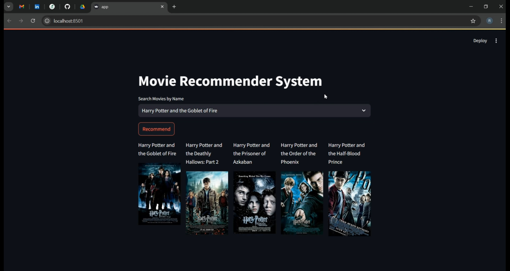
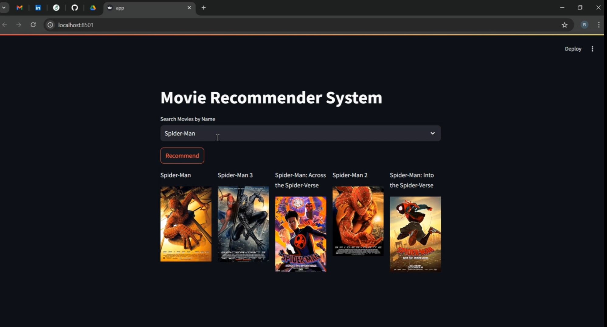
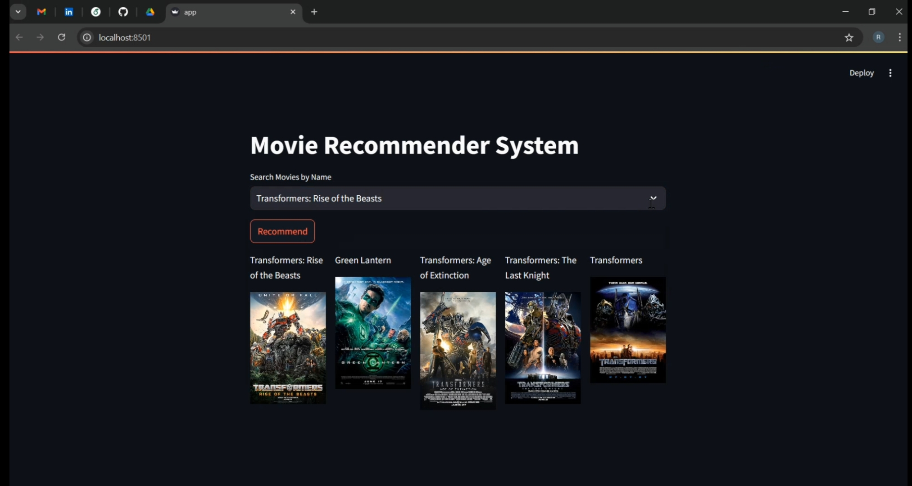
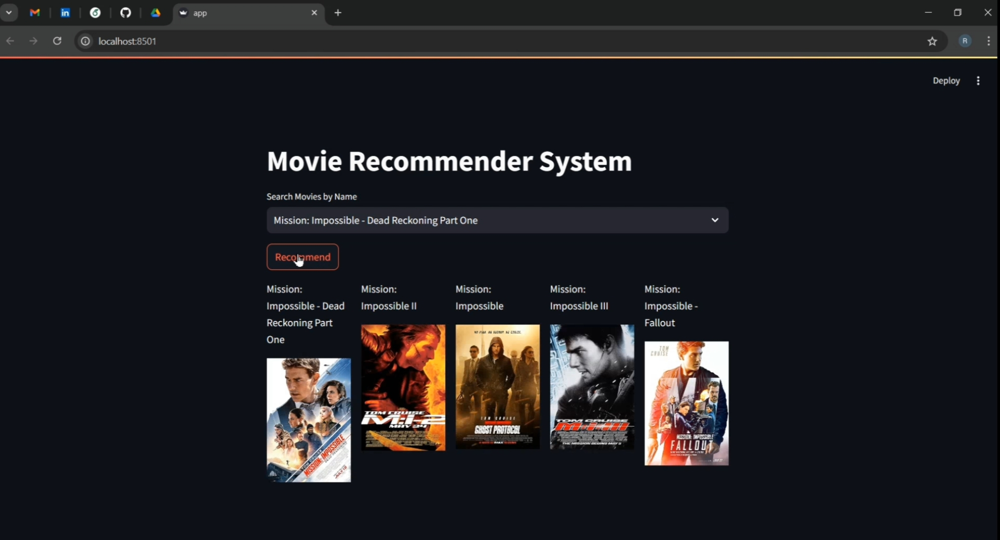

# Movie-Recommendation-System
Content based movie recommendation system build using Python and machine learning techniques to enhance user experience by providing personalized movie suggestions.

- The system recommends movies based on similarity scores, using a precomputed similarity matrix to suggest five movies similar to the user’s input.
- The application requires Python, Streamlit, Pandas, and Requests packages for functionality and data handling.

## Project Screenshots

